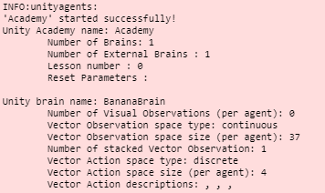
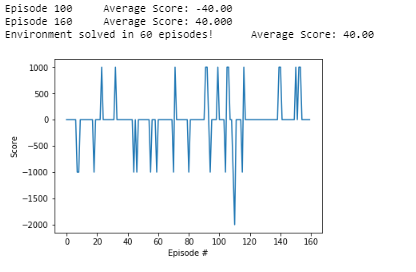

# Summary
This project is my first project on [Udacity's Deep Reinforcement Learning Nanodegree (Facebook PyTorch Nanodegree Scholarship Phase 3)](https://www.udacity.com/course/deep-reinforcement-learning-nanodegree--nd893). This project uses a Deep Q-Network (*DQN*) to train an agent that navigates a virtual world from sensory data.

# Project Details
The environment is Udacity’s `Banana` environment, which is an extension of Unity’s [UnityEnvironment](https://github.com/Unity-Technologies/ml-agents/blob/master/docs/Installation.md). The `Banana` environment has different versions for [Linux]( https://s3-us-west-1.amazonaws.com/udacity-drlnd/P1/Banana/Banana_Linux.zip), [Windows (32-bit)](https://s3-us-west-1.amazonaws.com/udacity-drlnd/P1/Banana/Banana_Windows_x86.zip), [Windows (64-bit)](https://s3-us-west-1.amazonaws.com/udacity-drlnd/P1/Banana/Banana_Windows_x86_64.zip) and [MacOSX](https://s3-us-west-1.amazonaws.com/udacity-drlnd/P1/Banana/Banana.app.zip). The following screenshot shows the environment set-up:

The state is a [numpy](https://numpy.org/) array of length 37.
The action is how the agent reacts to the environment. 

The environment is considered ‘solved’ when the average (arithmetic mean) score is greater than or equal to __32.0__. The Udacity rubric specifies a minimum of __+13__ over 100 episodes; this project achieved *twice* the minimum in just 60 episodes. If such success was not achieved, the threshold for when the environment is considered solved would have lowered.

# Directions
Complete the following steps interact with this project:

1. Determine your operating system (*OS*) 
   1a. Determine your number of bits (__only___ if you are using Windows) - click [here for help from Microsoft](https://support.microsoft.com/en-us/help/827218/how-to-determine-whether-a-computer-is-running-a-32-bit-version-or-64)
2. Click the relevant hyperlink from the following list
   - [Linux]( https://s3-us-west-1.amazonaws.com/udacity-drlnd/P1/Banana/Banana_Linux.zip)
   - [Windows (32-bit)](https://s3-us-west-1.amazonaws.com/udacity-drlnd/P1/Banana/Banana_Windows_x86.zip)
   - [Windows (64-bit)](https://s3-us-west-1.amazonaws.com/udacity-drlnd/P1/Banana/Banana_Windows_x86_64.zip)
   - [MacOSX](https://s3-us-west-1.amazonaws.com/udacity-drlnd/P1/Banana/Banana.app.zip)
3. Open Jupyter Notebook (or Jupyter Lab)
4. Change the second cell in `Navigation.ipynb` to the path of the file you downloaded (see the notebook for help)
5. Comment out the cell that closes the environment (use the `#` symbol)
6. Click **Cell>Run All**
7. Be patient as the magic happens
8. Uncomment and run the cell that closes the environment when you are done
